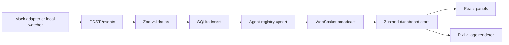

# Architecture

## Workspace Layout

```txt
apps/
  web/
    src/
      app/                 Dashboard composition
      components/          React dashboard chrome
      village/             PixiJS canvas and layout definitions
      stores/              Zustand state and selectors
      api/                 REST/WebSocket client helpers
      mock/                Seed agents and mock live simulation

  server/
    src/
      index.ts             Fastify app entrypoint
      agents/              Agent registry and derived state
      events/              Event ingest service and routes
      db/                  SQLite persistence
      live/                WebSocket broadcaster
      adapters/            Mock event adapter

packages/
  shared/
    src/
      schemas.ts           Zod schemas
      types.ts             TypeScript types
      derived.ts           Shared selectors and visual mapping
```

## Data Ownership

The backend owns durable telemetry:

- agent registry
- live event ingestion
- derived session state
- recent event history
- persisted snapshots
- WebSocket fanout

The frontend owns presentation state:

- selected agent
- selected building
- search query
- status filter
- hover target
- camera hints
- mock/live mode display

The Pixi scene receives already-derived visual state. It does not own telemetry or business state.

## Event Flow



## Persistence

The server uses a local SQLite file at `AGENT_VILLAGE_DB_PATH` or `.data/agent-village.sqlite`. The implementation uses Node's built-in `node:sqlite` module when present, keeping the MVP install light and local-first.

## Frontend Rendering

React renders dashboard chrome, lists, panels, filters, and controls. PixiJS renders:

- terrain tiles
- roads
- buildings
- labels
- status badges
- selection rings
- simple activity effects
- tiny resident markers

The village starts with procedural pixel/isometric blocks so the dashboard can ship without waiting on final art. Generated sprites can later replace procedural building renderers by matching the filenames in `docs/assets-prompts.md`.

## Error Handling

- Invalid events return `400` with Zod issues.
- Backend startup creates the SQLite directory if missing.
- WebSocket clients receive an initial snapshot after connecting.
- Frontend uses mock simulation when backend is unavailable.
- Connection state is visible in the bottom status bar and top-level store.
